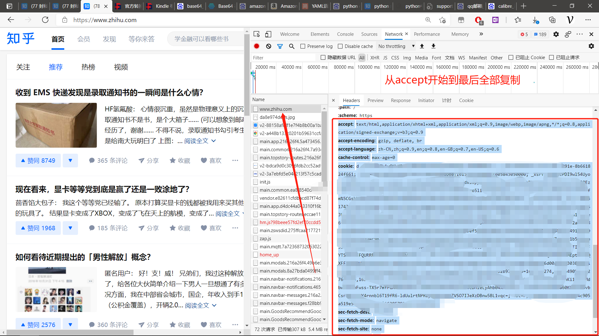
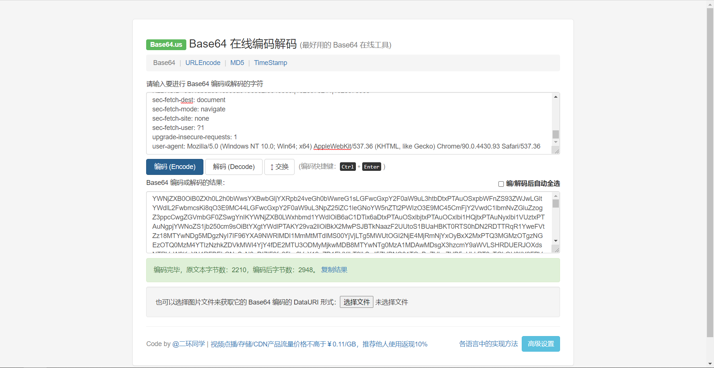

# 关于Zhihu2kindle

`Zhihu2kindle`项目提供一系列脚本，将知乎、果壳等网站的内容批量获取并解析打包成`mobi`格式供Kindle阅读。

# 使用方法

## 安装Python

本程序使用Python3编写，您可前往[Python官网](https://www.python.org/)下载大于Python3的版本。

## 安装依赖库

切换到本项目目录下后，在控制台输入如下命令安装
```
pip install -r requirement
```

## 配置

配置文件在`config`目录下。配置文件其实是一个`yml`文件。参考[配置](./配置)与[脚本](脚本)两章配置好配置文件。

### config.yml

```yaml
# config.yml

# KINDLEGEN_PATH：KindleGen.exe程序所在路径
# windows
KINDLEGEN_PATH: '.\zhihu2kindle\bin\kindlegen_windows.exe'

# linux
# KINDLEGEN_PATH：'.\zhihu2kindle\bin\kindlegen_linux'

# SAVE_PATH(可选)：全局保存路径。优先使用各个脚本独立的`SAVE_PATH`。
# 注意必须为绝对路径！必须为英文
SAVE_PATH: 'D:\zhihu2kindle\files'

# LOG_PATH(可选)：日志文件的路径 
LOG_PATH: '.\zhihu2kindle\log\'

# LOG_LEVEL：日志等级 
LOG_LEVEL: 'DEBUG'

# WRITE_LOG(可选) : 是否写日志文件，默认否
WRITE_LOG: false

# DOWNLOADER_WORKER(可选)：启动Downloader的数量，默认为1，建议为1~3。
DOWNLOADER_WORKER: 3

# PARSER_WORKER(可选)：启动Parser的数量，默认为1，建议为1。
PARSER_WORKER: 1

# RESULTER_WORKER(可选)：启动Resulter的数量，默认为1，建议为1
RESULTER_WORKER: 1
```

### email.yml

```yml
# email.yml

# EMAIL_USERNAME(可选)：发送给Kindle的邮箱地址
EMAIL_USERNAME : '8888@qq.com'
# PASSWORD(可选)：发送给Kindle的邮箱授权码（现在大部分邮箱都是用授权码，不懂百度）
PASSWORD : '12341323dasassf'
# SMTP_ADDR(可选)：发送给Kindle的邮箱SMTP。一般，163邮箱的为`smtp.163.com`；QQ邮箱为`smtp.qq.com`。
SMTP_ADDR : 'smtp.qq.com'
```

### zhihu_collection.yml

```yaml
# zhihu_collection.yml
# HEADER: 头部信息，记录知乎的登录信息
HEADER: "里面的信息一定要用双引号喔！"
```

**获取办法**

* 谷歌浏览器登录知乎
* 右键-“检查”
* 在弹出的窗口中选择“Network"
* 刷新网页
* 按图选择，复制



* 打开在线base64编码网站：[Base64 在线编码解码 | Base64 加密解密 - Base64.us](https://base64.us/)，粘贴内容，并编码。



* 该编码即为`HEADER`头部信息，记录知乎的登录信息

**因为有效期的缘故，一般建议30天更新一次HEADER信息**

## 使用

如使用本程序下载知乎某收藏夹[https://www.zhihu.com/collection/59744917](https://www.zhihu.com/collection/59744917)

切换到本项目目录下后，在控制台输入如下命令：

```
 python .\zhihu2kindle_cli.py zhihu_collection --i=59744917  --book_name=我的推送
```

电子书文档保存在配置项的`SAVE_PATH`文件夹中。

## 推送到Kindle

如果需要推送到Kindle，需要配置`email.yml`文件。

```
 python .\zhihu2kindle_cli.py zhihu_collection --i=59744917  --book_name=我的推送 --email=88888@kindle.cn
```

注意，该推送将会推送目标文件夹下面所有mobi文件。

## 增量更新

在运行过一次`Zhihu2kindle`之后，在目标文件夹下面出现一个名为`article.db`的数据库文件。`Zhihu2kindle`每次下载的时候都会检查这个数据库，避免重复下载。

举个例子，比如我知乎专门有一个收藏夹收藏要推送到Kindle的文章。每天我在知乎上收藏十篇文章到这个收藏夹，我希望使用`Web2kinlde`每天仅下载新增的十篇文章而不是把全部文章都获取下来。那么在运行一次程序，获取`191640375`所有内容之后。我第二天再往这个收藏夹新增十篇文章，当我再次运行，`Zhihu2kindle`会仅仅下载新增的那十篇文章而不会把收藏夹里全部文章重新下载一遍。

这个功能称之为`增量更新`。如果你不需要这种功能，你可以手动删除目标文件夹下面的`article.db`文件，或删除该数据库里面的指定条目数。

# 任务调度

本程序支持多用户、多任务进行推送操作。并且可以以天或者周为单位，自动调度任务。

## 使用方法

* 生成数据库。`python scheduler.py`
* 等看到`等待xx秒`信息出现的时候，说明数据库已经建立，结束程序。
* 使用`SqliteStudio`工具打开`scheduler.db`，插入任务信息。
  * COLLECTION_ID：知乎收藏夹ID
  * USERNAME：用户名，任意现阶段无用
  * EMAIL：kindle邮箱
  * BOOKNAME：书名
* 运行命令`python scheduler.py`，既可。在运行过程中，插入新任务信息，程序会在下一周期自动跑。

